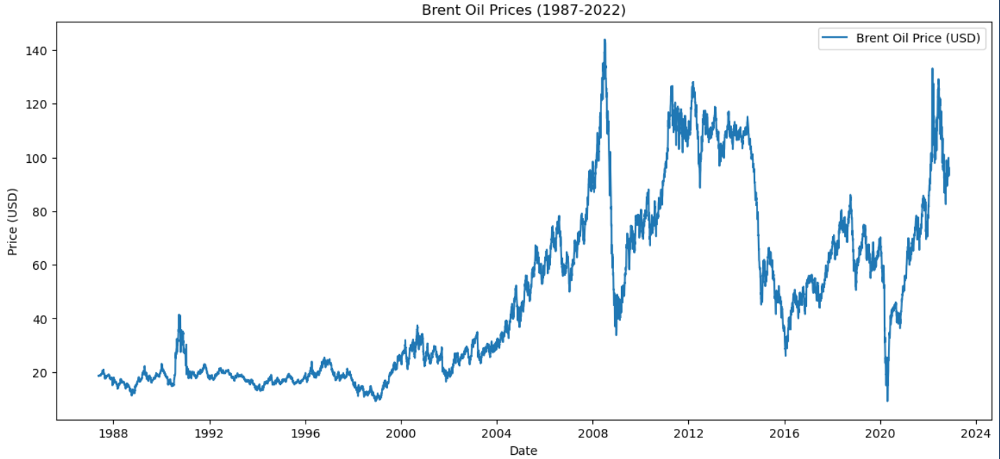
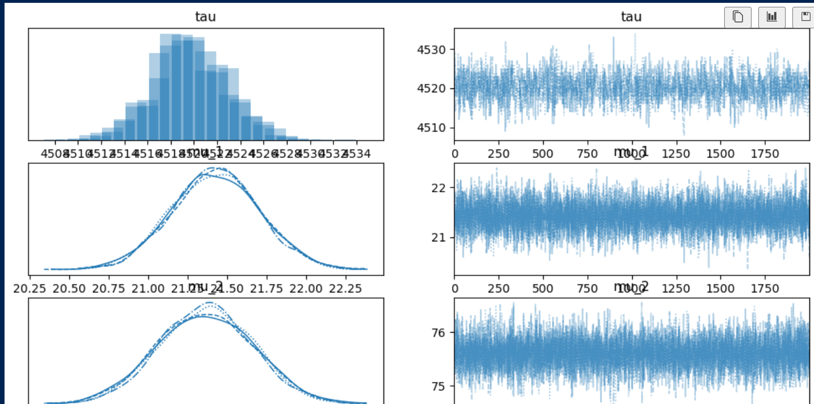
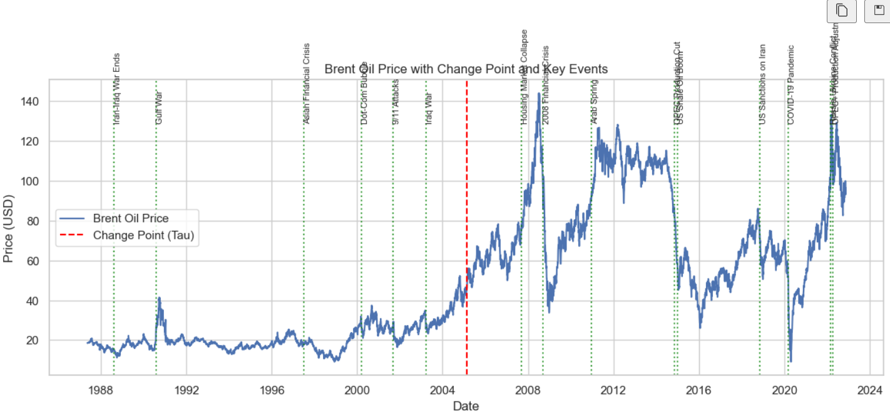

# Change Point Analysis & Statistical Modeling of Brent Oil Prices
**Author:** Bezawit - Assefa 

**Date:** 10 Feb 2026

---

## Project Overview
This project analyzes historical Brent oil prices to identify **structural breaks** caused by political, economic, and policy events using **Bayesian Change Point Analysis**. Detected shifts are quantified and linked to real-world events, providing actionable insights for:

- **Investors** – risk management and trade timing  
- **Policymakers** – market stability and policy design  
- **Energy Companies** – operational planning and cost forecasting  

**Business Problem:**  
The oil market is volatile. Sudden price shifts make decision-making difficult. By detecting these structural changes, stakeholders can **react faster, plan better, and manage risks effectively**.

---

## Data Overview
- **Source:** Daily Brent oil prices, May 20, 1987 – Sep 30, 2022  
- **Columns:**  
  - `Date` – Date of observation (`dd-mm-yyyy`)  
  - `Price` – Price per barrel (USD)  

**Exploratory Observations:**  
- Prices stable until early 2000s  
- Sharp spikes in 2005, 2008, 2011  
- Volatility increased after 2005  

**Visual Placeholder:**  

---

## Methodology

### 1. Data Preparation & EDA
- Convert `Date` to datetime format  
- Plot raw prices and log returns  
- Check for trends, stationarity, and volatility patterns  

### 2. Bayesian Change Point Modeling (PyMC)
- Define discrete uniform prior for **switch point (τ)**  
- Model mean before/after shift: **μ₁, μ₂**  
- Use `pm.math.switch` to switch means across τ  
- Model likelihood as Normal with volatility **σ**  
- Run MCMC sampling; check convergence (r_hat ~ 1, trace plots)  

**Visual Placeholder:**  

### 3. Event Correlation & Impact Quantification
- Compare detected change points with key geopolitical events and OPEC policy decisions  
- Quantify impact: before/after mean prices, percent change, volatility  

**Visual Placeholder:** 

---

## Key Findings

| Metric | Value | Interpretation |
|--------|-------|----------------|
| Change Point (τ) | 4520 (Feb 22, 2005) | Major structural shift |
| HDI 94% | 4513–4525 | 94% probability true change occurred in this 12-day interval |
| μ₁ (Before) | $21.42 | Average price before Feb 2005 |
| μ₂ (After) | $75.60 | Average price after Feb 2005 |
| σ | $18.59 | Volatility increased after the change point |

**Business Insights:**  
- Feb 2005 price jump (+252.87%) caused by **OPEC production cuts** and **rising global demand**  
- Investors, policymakers, and energy companies can use this information to **mitigate risk and optimize decisions**

---

## Business Impact

### Investors
- **Q:** When did major shifts occur?  
- **A:** Feb 22, 2005 ($21 → $75, +252.87%)  
- **Actionable Insight:** Hedge risk, time trades, diversify portfolios  

### Policymakers
- **Q:** What events caused significant changes?  
- **A:** OPEC decisions, geopolitical tensions, sanctions  
- **Actionable Insight:** Stabilize markets using energy reserves, policy interventions  

### Energy Companies
- **Q:** How do shifts affect operations?  
- **A:** Increased prices and volatility affect budgets, supply chains, and contracts  
- **Actionable Insight:** Pre-secure supply contracts, optimize production and inventory  

---

## Dashboard & Technical Implementation

- **Backend:** Flask API serving:  
  - Historical price data  
  - Change point analysis results  
  - Event correlation data  
- **Frontend:** React dashboard featuring:  
  - Interactive charts (Recharts / Chart.js)  
  - Filters & date selectors  
  - Event highlighting & drill-down analysis  

**Visual Placeholders:**  

---

## Limitations & Assumptions
- Detects statistical correlation, not causation  
- Focused on mean changes; volatility regimes & macroeconomic factors not included  
- Assumes daily prices represent market behavior  

---

## Future Work
- Integrate macroeconomic indicators (GDP, inflation, exchange rates)  
- Explore advanced models (VAR, Markov-Switching) for dynamic market regimes  
- Detect multiple change points for more nuanced analysis  

---

## Learning Outcomes
- **Skills:** Bayesian Change Point Analysis, PyMC, MCMC diagnostics, analytical storytelling  
- **Knowledge:** Time series modeling, probabilistic inference, event correlation  
- **Communication:** Reporting insights to investors, policymakers, and energy companies  

---

## References
- PyMC: [https://www.pymc.io/](https://www.pymc.io/)  
- Change Point Detection: [https://forecastegy.com/posts/change-point-detection-time-series-python/](https://forecastegy.com/posts/change-point-detection-time-series-python/)  
- Data Science Workflow: [https://www.datascience-pm.com/data-science-workflow/](https://www.datascience-pm.com/data-science-workflow/)  
- React Dashboard Templates: [https://github.com/flatlogic/react-dashboard](https://github.com/flatlogic/react-dashboard)

---

💡 **Bottom Line:**  
This project transforms historical Brent oil price data into **actionable insights**, pinpointing high-confidence structural breaks and their causes. Stakeholders can make better decisions, manage risk, and optimize operational planning using these data-driven insights.
